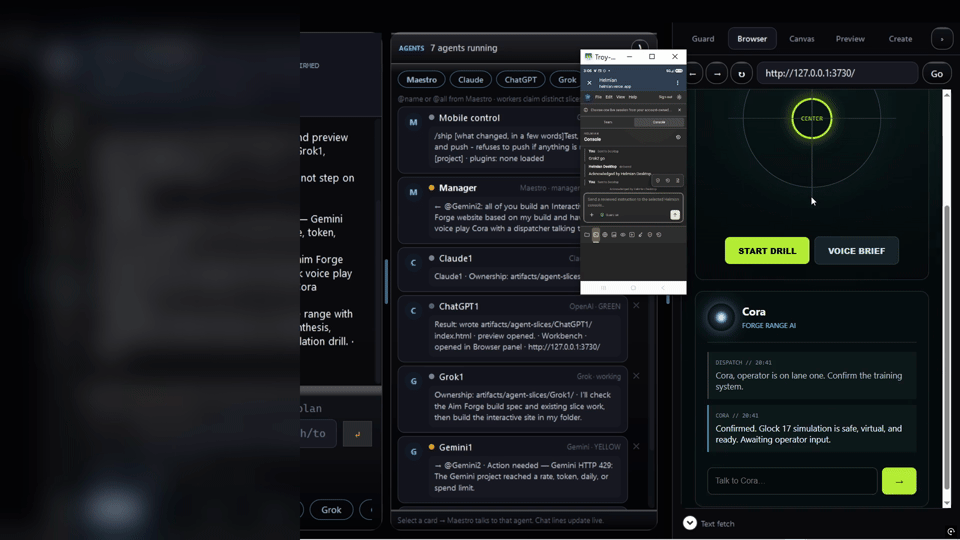

# Helmion



**A local governance kernel for coding agents.** Helmion sits between an AI coding
agent and the things it is able to change, and makes the risky steps
deterministic: which actions run unattended, which pause for a human, which are
refused outright, what lands in a durable audit trail, and which single session
holds the write lease on a project.

It is deliberately early — a working local prototype with real tests, not a
hardened multi-tenant product. [Honest boundary](#honest-boundary) at the end of
this file states exactly what it does and does not do yet, in plain terms.

Helmion runs entirely on your machine. Its durable state lives in a
PostgreSQL/Neon database **you own**, reached through your own environment (see
[`.env.example`](.env.example)). Nothing is sent to a Helmion service, because
there is no such service.

## Quick start

Requires **Node.js 20 or newer**. The desktop Pilot additionally needs the **.NET
SDK** and is Windows-only; everything else is cross-platform.

```powershell
npm install
npm run verify
```

`npm run verify` runs `node --check` over every module and then the full test
suite. It needs **no database, no API key, and no network** — if it passes, the
kernel is sound on your machine. That is the fastest way to judge this repo.

To use the CLI anywhere:

```powershell
npm link
helmion --help
helmion init <path-to-workspace>
```

`helmion init` scaffolds an isolated workspace and writes only inside the
directory you name:

```text
<workspace>\.helmion\
  config.json
  autonomy_rules.json
  hooks\pretooluse.ps1
```

Nothing above contacts a database. Database commands are opt-in and refuse to run
without an explicitly named endpoint — see
[Database migrations](#database-migrations).

To run the Windows desktop Pilot:

```powershell
npm run desktop:verify   # build + smoke tests
npm run desktop:run
```

## What is in the box

| Component | Entry point | What it does |
|---|---|---|
| Governance kernel | `src/core/` | policy, blockers, leases, audit and provenance logs |
| `helmion` CLI | `bin/helmion.mjs` | `init`, `migrate`, `db-inspect`, `agent`, `agent-os`, `advisory` |
| Background jobs | `bin/helmion-jobs.mjs` | triage, commit-message, log-monitor, dictation-summary |
| MCP servers (4) | `bin/mcp-helmion-*.mjs` | context, flywheel, advisory, codex |
| Desktop Pilot | `desktop/` | Windows WPF control centre |
| Herald | `src/herald/`, `desktop/Helmion.Desktop.Core/Herald/` | phone-paired companion — approve/deny and monitor a running desktop session from your phone |
| Migrations | `sql/NNN_*.sql` | checksum-verified, advisory-locked runner |

Tests live in `test/` — 51 files, 943 tests, run by `npm test` (verified this
session: 943 pass, 0 fail, 23s). Documentation for each
subsystem is in [`docs/`](docs/); dated session notes and superseded audits are
kept out of the way in [`docs/archive/`](docs/archive/).

## What writes outside this repository

**Two features write outside the repo, on purpose, and only when you ask.**
Nothing writes there on clone, on install, or on `helmion init`.

| What | Writes where | Triggered by |
|---|---|---|
| `helmion agent-os install` | the target's context and companion files under `~/.claude`, `~/.codex` or `~/.gemini` | you run it — and `--yes` is required before anything is applied |
| Desktop Pilot → **Sync Profile** | `~/.claude`, `~/.claude.json`, `~/.gemini/GEMINI.md`, `%APPDATA%\Claude\` | you click the button |

`BASE_RULES.md`, `LEARNINGS.md` and `LESSONS.md` are treated as **living
documents**: an existing one is never overwritten by any flag or code path, and a
new profile receives a byte-for-byte copy of yours instead of a blank template.
No settings file is edited automatically — hook configuration is printed for you
to merge yourself.

## Phase One: Maestro and Codex

Phase One adds a separate Codex-side counterpart without changing the current
Claude setup:

- a vendor-neutral Maestro adapter with a Codex binding;
- read-only Codex mode by default;
- customer-owned Neon/PostgreSQL as the only production source of Maestro
  state;
- a database-enforced single active write lease per project;
- durable checkpoints, explicit lease release, and atomic lease transfer;
- generated handoffs containing the checkpoint plus current blockers, context,
  and active rules;
- an explicit `INCOMPLETE HANDOFF` warning when no checkpoint is available;
- a high-risk gate while the latest incomplete handoff lacks durable human
  confirmation;
- payload-hashed idempotency keys for retry-safe governance writes; and
- operation classes that let optional telemetry fail open while governance
  writes require a confirmed database commit.

Phase One does not connect to or migrate a live database automatically. It also
does not install a Codex MCP configuration. Those remain explicit customer
actions.

See [docs/MAESTRO_PHASE_ONE.md](docs/MAESTRO_PHASE_ONE.md) for the state model
and operating sequence.
See [docs/PHASE_TWO_NEON_RUNBOOK.md](docs/PHASE_TWO_NEON_RUNBOOK.md) for the
guarded fresh-project migration and isolated switch verification.
See [docs/HUMAN_CONFIRMATIONS.md](docs/HUMAN_CONFIRMATIONS.md) for the local
Phase Two signed confirmation protocol and its enrollment boundary.
See [docs/PILOT_RISK_POLICY.md](docs/PILOT_RISK_POLICY.md) for the precise
auto-run/pause/block policy and
[docs/WINDOWS_OWNER_KEY_PILOT.md](docs/WINDOWS_OWNER_KEY_PILOT.md) for the
Windows owner-key lifecycle.
See [docs/DESKTOP_PILOT.md](docs/DESKTOP_PILOT.md) for the native Windows
Personal Pilot control center, live-local read-only boundary, and packaging.
See
[docs/PERSONAL_PILOT_ACTIVATION.md](docs/PERSONAL_PILOT_ACTIVATION.md) for the
provider registry, protected-profile, exact-target, Policy Pack, interaction,
and canary-first activation design. See
[docs/PROVIDER_ADAPTER_CONTRACT.md](docs/PROVIDER_ADAPTER_CONTRACT.md) for the
provider-neutral invocation/capability/evidence/safety contract. See
[docs/PROTECTED_PROVIDER_PROFILES.md](docs/PROTECTED_PROVIDER_PROFILES.md) for
the CurrentUser-DPAPI store, CLI/API auth separation, redacted connection-test
contract, and exact Neon Development binding. See
[docs/HELMION_PROFILE_PACKAGE.md](docs/HELMION_PROFILE_PACKAGE.md) for the
portable, per-item-reviewed policy/learning/profile package requirement.
See [docs/LIVE_ACTIVITY_STREAM.md](docs/LIVE_ACTIVITY_STREAM.md) for the
provider-neutral Orchestration Timeline, evidence-binding, and recording
redaction contract.
See [docs/MULTI_USER_RELEASE_ROADMAP.md](docs/MULTI_USER_RELEASE_ROADMAP.md)
for the explicit tenant, identity, audit, integration, installer, and testing
gates between the current pilot and a polished multi-user release.

## Phase Two: signed one-time human confirmations

Migration `003_human_confirmations.sql` adds durable trusted Ed25519 public-key
identities and confirmation records. A signed assertion binds the verified
identity to one project, handoff, canonical Tier B action hash, nonce, issue
time, and expiry. The handoff target lease holder can atomically consume one
matching confirmation; it cannot be consumed for another action, after expiry,
after key revocation, or a second time.

Trusted-key enrollment is deliberately not an agent or MCP tool. An
authenticated owner/admin control path must establish the public-key-to-person
mapping out of band. Private keys never belong in Helmion or the database.
Tier B advisor reviews remain advisory, and rule promotion remains disabled.

The Windows pilot tooling is an explicit interactive setup, not an install
side effect. It keeps the local signing key under Windows CurrentUser DPAPI,
adds a distinct owner signing passphrase for same-user process resistance,
creates a separately passphrase-encrypted recovery package, exports only
public enrollment JSON, and requires an interactive `APPROVE` or `DECLINE`
decision plus the signing passphrase before producing a five-minute
action-bound assertion.

## Existing kernel behavior

- Active-blocker matching uses project scope plus exact paths, module names, or
  error signatures. Generic shared-word overlap is never a hard match.
- Resolution proof is validated in application code and PostgreSQL.
- Candidate rules begin at `flag` severity and are checked against ordinary
  work canaries.
- Destructive shell patterns and `block` rules deny locally.
- Text embedded in commands, tool input, comments, or source code cannot act
  as an approval.
- Advisory votes are read-only evidence bound to an immutable action hash.
  They are not a human approval.
- EDI 204 L3-over-AT8 weight precedence and the AS2 997/990 delivery state
  machine remain covered by tests.
- The tool-call gate (`evaluateToolCall`, `src/core/governance-gate.mjs`) is
  fail-closed regex-rule evaluation, not a model call: an unreadable rule set,
  a bad pattern, or an internal error all refuse rather than let a call
  through unevaluated. Measured on this machine, 2,000 warmed-up calls
  averaged **0.11ms each**.

## Herald: the phone companion

Herald pairs one phone to one running desktop session — a scoped, deliberate
input surface, not a terminal or file browser. From the phone you get session
and agent status, a Guard digest, and the ability to approve or deny pending
actions; nothing else is reachable.

- One-time enrollment: the desktop generates a random proof secret and an
  8-digit confirmation code, you confirm from your signed-in web account, the
  desktop redeems the code for a registration token stored under Windows
  CurrentUser DPAPI.
- Every request after that carries a single-use nonce; a reused nonce is
  rejected outright (`401 replay_denied`), not merely logged.
- Data sent to the phone is sanitized before it leaves the desktop — workspace
  paths, transcript contents, provider credentials, and tool payloads are
  never included, only session state and a Guard status.
- Revoking a device takes effect on its next status check or heartbeat, not
  eventually.
- Verified working end-to-end on this machine, phone → relay → desktop →
  agent, logged in `.helmion/audit/herald-*.jsonl` and
  `%LOCALAPPDATA%\Helmion\remote-control-realtime.log`.

Full wire contract: [`docs/herald/REMOTE_CONTROL_V1.md`](docs/herald/REMOTE_CONTROL_V1.md).

## Workspace initialization

Verification and `helmion init` are covered in [Quick start](#quick-start). Two
details worth stating explicitly: the generated config records
`codexAdapterMode: read-only`, and existing home-directory hooks are never
replaced.

## Agent OS

`helmion agent-os install` sets up a self-improvement loop for a coding agent:
a lean core-rules file, the companion logs it accumulates, and two hooks that
carry state between sessions. It is generic — it contains no personal, project,
or customer content, and a test enforces that (see below).

```powershell
helmion agent-os install                      # dry run — prints the plan, writes nothing
helmion agent-os install --yes                # write it, all three targets
helmion agent-os install --target claude --yes
helmion agent-os install --yes --json         # machine-readable, for a UI button
```

`--dir` overrides the destination. Installing several targets into one `--dir`
gives each its own subdirectory.

### What it installs

| Target | Directory | Context file |
|---|---|---|
| `claude` | `~/.claude` | `CLAUDE.md` |
| `codex` | `~/.codex` | `AGENTS.md` |
| `gemini` | `~/.gemini` | `GEMINI.md` |

Each target gets the same set:

```text
<dir>/
  CLAUDE.md | AGENTS.md | GEMINI.md   core rules + a summary of the loop
  LESSONS.md                          corrections that must not repeat
  LEARNINGS.md                        techniques worth reusing
  BLOCKERS.md                         what is stuck right now
  WINS.md                             what shipped, and what proved it
  SESSION_BOARD.md                    which session is holding which files
  memory/MEMORY.md                    one-line index of the above
  agent-os/                           installer-owned; safe to delete
    AGENT_OS.md                       the full loop + advisory lane
    settings.hooks.json | hooks.json  hook config to merge yourself
    MERGE_HOOKS.md                    how to merge it
    hooks/session-start-context.mjs   injects blockers/lessons at session start
    hooks/stop-capture.mjs            journals each turn
    journal/                          created on first captured turn
```

### The loop

```text
capture  ->  propose  ->  review  ->  promote
(hook)      (the agent)  (you)      (only after you approve)
```

The turn-capture hook journals each turn. The agent turns those into candidates
in the **Proposed** section of `LESSONS.md` or `LEARNINGS.md`. Nothing leaves
that section without you moving it. The session-start hook then reads the
promoted state back at the start of the next session, so it opens knowing what
the last one learned and what is still blocked.

Anything a secondary model produces stays in the advisory lane described in
`agent-os/AGENT_OS.md`: readable, never authoritative, never auto-promoted.

### What it will not do

- It never overwrites your files. A context file that already exists gets a
  delimited block appended; the companion logs are created once and then left
  alone. Re-running is a no-op.
- It never edits `settings.json` (or Codex's `hooks.json`). Those carry keys
  this installer knows nothing about, so hook wiring is written as a snippet
  beside them with merge instructions. **Until you merge it, the hooks are not
  active** — the `hooksWired: false` field in the JSON output says so plainly.
- It ships no personal content. `test/agent-os.test.mjs` scans every template
  against a denylist of names, paths, credentials, and project references, and
  is itself checked against deliberately poisoned input so a scanner that can
  no longer fail cannot pass silently.

### Uninstalling

Delete the `agent-os/` directory and remove the hook entries you merged into
your settings file. The logs outside `agent-os/` are your own notes — keep or
delete them as you like.

## Database migrations

On a new database, schema creation requires a role with `CREATE` on the
database; the new Neon project's owner role is suitable for this one-time
bootstrap. Use a schema-scoped application role after bootstrap.

Live CLI database commands require both `HELMION_DATABASE_URL` and an explicit
matching Neon endpoint ID. Inspect the selected target before writing:

```powershell
helmion db-inspect --expect-endpoint ep-example-a1b2c3d4
helmion migrate --expect-endpoint ep-example-a1b2c3d4 --require-empty-helmion
```

The runner:

1. rejects a connection URL whose Neon endpoint does not match the explicit
   expected endpoint before opening a connection;
2. optionally refuses a target where the `helmion` schema already exists;
3. discovers ordered `sql/NNN_name.sql` migrations;
4. serializes runners with a PostgreSQL advisory transaction lock;
5. checks the stored SHA-256 checksum of every previously applied migration;
6. applies each new migration in a transaction; and
7. writes an acknowledged migration record only after the migration succeeds.

`sql/002_maestro_phase_one.sql` is additive. Its partial unique index is the
database backstop that prevents two active leases for one project.
`sql/003_human_confirmations.sql` is also additive except for extending the
Maestro operation-type check to include idempotent confirmation consumption.

After migrations match, `helmion phase-two-switch-test` creates only a
reserved `helmion-phase-two-*` project row, commits a Codex lease and
checkpoint, transfers the lease to an isolated Claude test instance, verifies
the complete handoff, and releases the test lease. It does not install or
modify a Claude hook or adapter.

## Codex MCP adapter

After linking the package, register `mcp-helmion-codex` in the Codex-side
configuration only. Its default mode exposes two reads:

- `helmion_maestro_project_state`
- `helmion_maestro_latest_handoff`

Example:

```json
{
  "mcpServers": {
    "helmion-codex": {
      "command": "mcp-helmion-codex",
      "env": {
        "HELMION_CODEX_MODE": "read-only"
      }
    }
  }
}
```

The process also needs `HELMION_DATABASE_URL` in its local environment. Do not
put a database URL in checked-in MCP configuration.

Write tools are listed only when both of these are explicitly configured:

```text
HELMION_CODEX_MODE=read-write
HELMION_CODEX_INSTANCE_ID=<stable local session/instance identifier>
```

Enabling them does not bypass lease ownership. Each governance write still
requires the active lease where applicable, an idempotency key, and a durable
transaction commit.

Read-write mode also advertises signed-confirmation recording and one-time
handoff-action authorization. Recording verifies a signature against an
already-enrolled public key. Authorization requires the active target lease
and consumes the exact confirmation in the same transaction as its durable
idempotency result.

## Honest boundary

The supplied evidence demonstrates a Claude Code-centered local prototype,
shared Neon reads/writes, advisory use, and a positive-controlled distillation
flow. It does not demonstrate a hardened cross-vendor product.

This phase establishes the neutral state, switching seam, a cryptographic
one-time confirmation primitive, a native desktop foundation, and a
current-user read-only local-service slice. It does not yet provide
authenticated identity enrollment, role-based access, tenant isolation,
provider OAuth, governed provider execution, or a live Claude adapter. Until
an authenticated owner/admin path enrolls trusted public keys, Tier B handoff
actions remain blocked.
